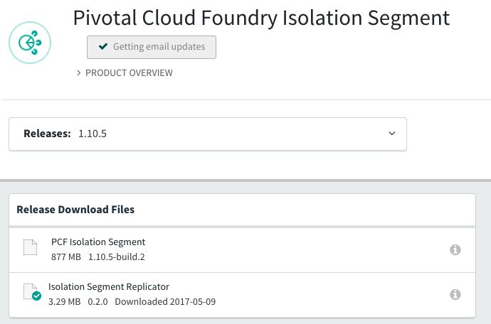
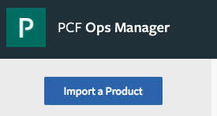
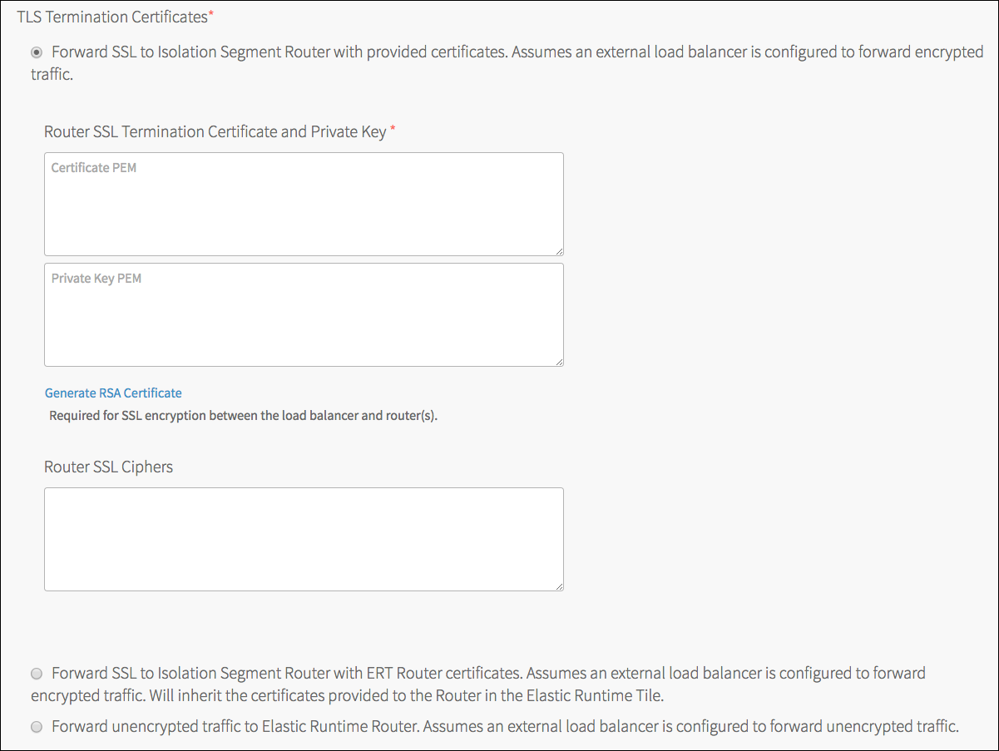

# Install Isolation Segments on Pivotal Cloud Foundry

## Install latest CF CLI

Download and install the latest (at least >= 6.26) CF CLI from [CF CLI Downloads](https://github.com/cloudfoundry/cli#downloads).

Copy CF CLI binary to a directory that's on our path execution.

```
$ ~/bin/cf -v
cf version 6.26.0+9c9a261fd.2017-04-06
```

## Clone and install isolation segments tile
We will want to download the isolation segments tile from PivNet, clone tile to segments thah align to my requirements, upload and configure tile.

### Download isolation segments tile from PivNet
Download [isolation segments tile](https://network.pivotal.io/products/isolation-segment).

**Note:** you will need to have an account on PivNet to download this tile.

### Download tile replicator
We will need to create at least 1 replicate of the isolation tile. A unique name is given to each tile, one that will be used as the isolation segment we will create later via CF CLI. The replicator can be downloaded from [here](https://network.pivotal.io/products/isolation-segment).



Once downloaded, unpack the ZIP file. It will contain three binaries, please use the one respective to the OS where you will be replicating the tile. This may be macOS (Darwin), and so on... **If on macOS or Lunux be sure to set the files to executable.**

### Clone tile
```
replicator \
    -name "name_of_my_isolation_segment" \
    -path /absolute/path/to/tile.pivotal \
    -output /absolute/path/to/output.pivotal
```

**Note:** the "name" as mentioned in the command has a length limitation of 32 characters.

## Upload and configure isolation segments tile
Let's upload the replicated tile, configure the tile, and apply changes
### Upload tile to Ops Manager
In a browser navigate to your Ops Manager URL and login.

Select "Import a Product"



**Note:** tile will take some time to upload

Follow the [Pivotal documents](http://docs.pivotal.io/pivotalcf/1-10/opsguide/installing-pcf-is.html#config) for configuring the tile according to your network settings

**Several Notes**
* When configuring the Networking settings, do not select "Forward SSL to Isolation Segment Router with ERT Router certificates", this is an experimental feature that will be removed in a future version of the tile.
* There will be two network configurations you can choose from;
   * "Forward SSL to Isolation Segment Router with provided certificates" - should be the default for all non-development environments. You can copy in the certificate used on the externl load balancer. 
     * Load balancer can forward encrypted traffic to the Elastic Runtime Router for the isolation segment. Be sure to complete the fields for the Router SSL Termination Certificate and Private Key and Router SSL Ciphers. 
     * If you need to create a new certificate, you can specify a separate wildcard domain that's specific to the isolation segment.
   * "Forward unencrypted traffic to Elastic Runtime Router" - this is a good setting to use in a development environment where load balancing is not required


Once configured, apply changes.

## CF CLI
Now that the isolation segments tile has been applied to the environment we can now begin to setup the necessary segments, assign them to org and spaces and then push an application to the newly created isolation segment.

### Create an isolation segment
The name of the isolation segment **must** be the name we assigned to the tile above. Otherwise you will get a `NoCompatibleCell` error when pushing an application

```
$ ~/bin/cf create-isolation-segment is-test
Creating isolation segment is-test as admin...
OK
```

### Enable isolation segments for an organization

### Set isolation segments as default for an organization (any space created will be assigned to the isolation segment)

#### Retrieve isolation segment guid, JSON from V3 CAPI

#### Retrieve organization guid, JSON from V3 CAPI

#### Set default isolation segment for an organization

#### Enable isolation segments for an organization

#### Enable isolation segments for an existing space

#### Let's push an application
